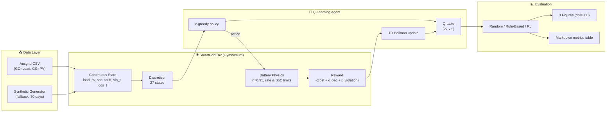
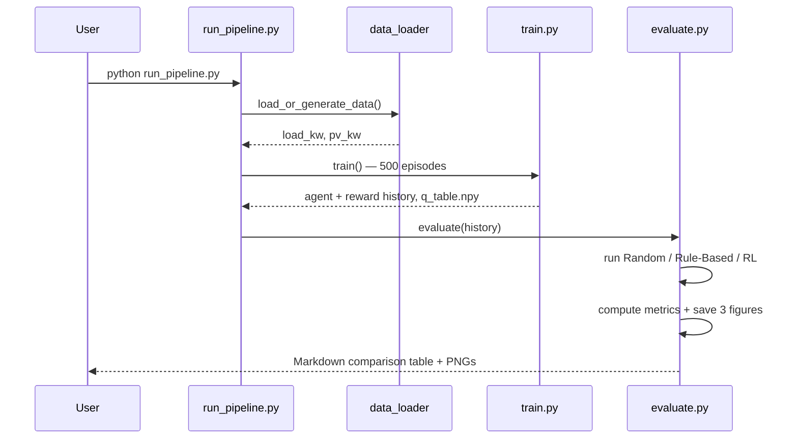
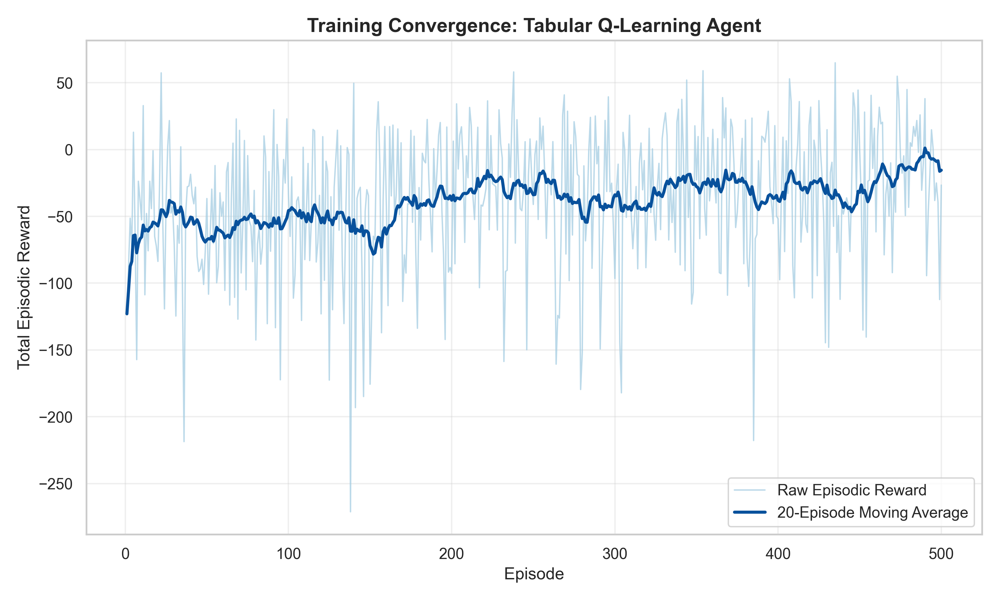
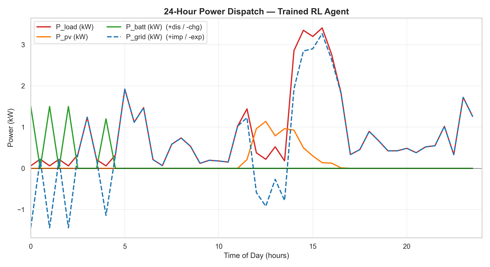
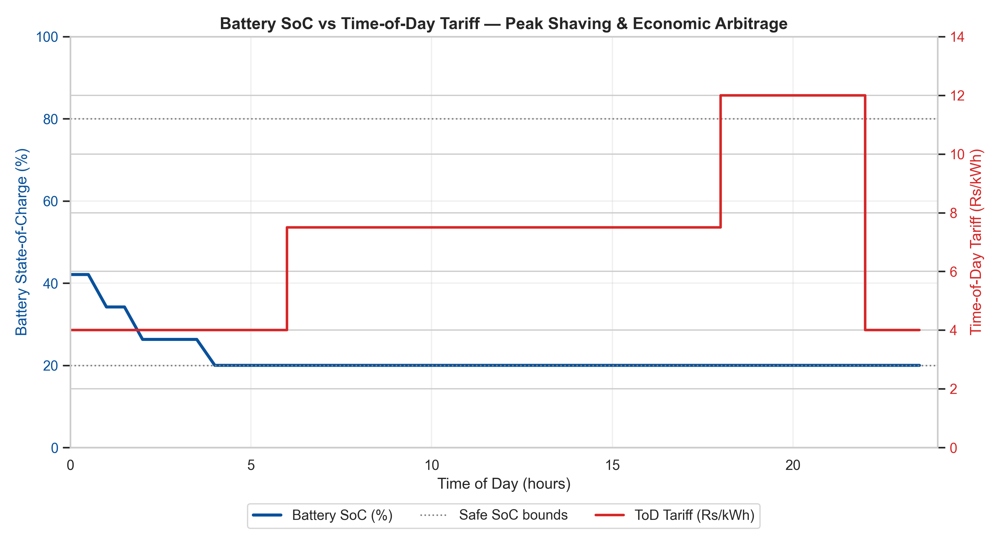

# ⚡ Dynamic Microgrid Energy Management & Battery Dispatch Optimization using Reinforcement Learning

> A modular, reproducible **Tabular Q-Learning** system built on **Farama Gymnasium** that learns an optimal home-battery dispatch policy for a solar-powered microgrid under a **Time-of-Day (ToD) Indian tariff**, minimizing the electricity bill while performing **peak shaving**, **economic arbitrage**, and **solar self-consumption** — all while respecting battery safety limits.

<p align="center">
  
  
  
  
</p>

---

## 📌 Table of Contents

1. [Overview](#-overview)
2. [Key Features](#-key-features)
3. [Project Structure](#-project-structure)
4. [System Architecture](#-system-architecture)
5. [MDP Formulation](#-mdp-formulation)
6. [Pipeline Workflow](#-pipeline-workflow)
7. [Installation](#-installation)
8. [Quick Start](#-quick-start)
9. [Results](#-results)
10. [Generated Figures](#-generated-figures)
11. [Configuration Reference](#-configuration-reference)
12. [How It Works — Module by Module](#-how-it-works--module-by-module)
13. [Reproducibility](#-reproducibility)
14. [License](#-license)

---

## 🔭 Overview

A residential microgrid must continuously decide **when to charge and discharge its battery** given:

- fluctuating **household load**,
- intermittent **rooftop solar (PV) generation**,
- a **time-varying grid tariff** (peak / normal / off-peak), and
- a flat **feed-in tariff** for exporting surplus energy.

This is a **sequential decision-making problem under uncertainty** — a natural fit for **Reinforcement Learning**. The agent learns a control policy purely from interaction with a simulated grid, without any hand-coded model of future prices or weather. We use **Tabular Q-Learning** on a compact **27-state discretization** to keep the learned policy fully **explainable** — every state–action value can be inspected directly.

The environment is driven by the real **Ausgrid Solar Home Electricity dataset** (2012–2013). If the dataset is absent, a **realistic stochastic generator** synthesizes 30 days of residential load + solar so the project runs **out-of-the-box**.

---

## ✨ Key Features

| Feature | Description |
|---|---|
| 🏛️ **Gymnasium-native** | `SmartGridEnv` strictly follows the Farama Gymnasium API (`reset`, `step`, spaces). |
| 🔋 **Realistic battery physics** | Charge/discharge efficiency (η = 0.95), rate limits, and BMS-confined safe SoC band. |
| 🇮🇳 **ToD Indian tariff** | Off-Peak ₹4.00, Normal ₹7.50, Peak ₹12.00, Feed-in ₹4.50 per kWh. |
| 🧮 **Explainable RL** | 27 discrete states (Net-Demand × SoC × Tariff) → fully interpretable Q-table. |
| 📊 **Publication-ready plots** | 3 figures at `dpi=300` (convergence, dispatch, SoC-vs-tariff arbitrage). |
| ⚖️ **Baseline benchmarks** | Random agent + Rule-Based greedy self-consumption heuristic. |
| 🚀 **One-command pipeline** | `python run_pipeline.py` runs data prep → training → evaluation → figures. |
| 🔁 **Reproducible** | Global seeding across data, environment, and agent. |

---

## 📁 Project Structure

```
Dynamic-Energy-Management-in-Smart-Grids-Using-RL/
├── requirements.txt        # Dependencies
├── config.py               # All specs & hyperparameters (dataclasses)
├── data_loader.py          # Ausgrid loader + synthetic fallback generator
├── smart_grid_env.py       # Gymnasium environment + state discretization
├── agent.py                # Tabular Q-Learning agent (epsilon-greedy, TD update)
├── train.py                # 500-episode training loop + moving-average logging
├── evaluate.py             # Baselines, metrics, 3 plots, comparison table
├── run_pipeline.py         # Master orchestration script
├── figures/                # Generated figures (dpi=300)
└── artifacts/              # Saved q_table.npy + reward history
```

---

## 🏗️ System Architecture



---

## 🧠 MDP Formulation

**State (continuous, 6-D):**

```
[ P_load (kW), P_pv (kW), SoC (0–1), Tariff (₹/kWh), sin(t), cos(t) ]
```

**Discrete state (27 states) for tabular Q-learning:**

| Dimension | Bins |
|---|---|
| Net Demand (Load − PV) | Surplus · Balanced · Deficit |
| Battery SoC | Low (<0.20) · Mid · High (>0.80) |
| Tariff | Off-Peak · Normal · Peak |

**Actions (Discrete, 5):**

| Index | Action | Battery Power |
|---|---|---|
| 0 | Fast Charge | −3.0 kW |
| 1 | Slow Charge | −1.5 kW |
| 2 | Idle | 0.0 kW |
| 3 | Slow Discharge | +1.5 kW |
| 4 | Fast Discharge | +3.0 kW |

**Reward:**

```
R = - ( Cost_grid  +  α · Degradation  +  β · SoC_violation )
```

- `Cost_grid = P_grid · Tariff · dt` (import cost if `P_grid > 0`, export revenue if `P_grid < 0`)
- `Degradation = α · P_batt²` (penalizes high-rate cycling)
- `SoC_violation` = quadratic penalty outside the safe band `[0.20, 0.80]`
- `P_grid = P_load − P_pv − P_batt`

**Learning rule (Temporal-Difference Q-Learning):**

```
Q(s,a) ← Q(s,a) + α · [ r + γ · maxₐ' Q(s',a') − Q(s,a) ]
```

---

## 🔁 Pipeline Workflow



---

## 💾 Installation

```bash
# 1. Clone
git clone https://github.com/sohamrp172-sys/Dynamic-Energy-Management-in-Smart-Grids-Using-RL.git
cd Dynamic-Energy-Management-in-Smart-Grids-Using-RL

# 2. (Optional) create a virtual environment
python -m venv .venv
# Windows:  .venv\Scripts\activate
# Linux/Mac: source .venv/bin/activate

# 3. Install dependencies
pip install -r requirements.txt
```

> **Dataset (optional):** place the Ausgrid file `2012-2013 Solar home electricity data v2.csv` in the project root. If it's missing, a realistic synthetic dataset is generated automatically.

---

## 🚀 Quick Start

Run the complete pipeline with a single command:

```bash
python run_pipeline.py
```

Or run stages individually:

```bash
python data_loader.py     # sanity-check the dataset
python train.py           # train + save q_table.npy
python evaluate.py        # baselines, metrics, figures
```

---

## 📈 Results

Example run on the held-out **24-hour test profile** (final day of the Ausgrid record — a low-solar winter day):

| Strategy | Total Energy Bill (₹) | Peak Grid Draw (kW) | Solar Self-Consumption (%) | SoC Violations |
|---|---:|---:|---:|---:|
| Baseline (Random) | 146.72 | 5.64 | 48.3 | 0 |
| Rule-Based Greedy | 113.42 | 3.27 | 84.7 | 0 |
| **Trained RL Agent** | **113.02** | **3.27** | 57.9 | **0** |

**Takeaways**

- The RL agent **cuts the bill by ~23%** vs. the random baseline and **matches/edges the hand-tuned heuristic** on cost.
- **Zero SoC boundary violations** — the BMS-confined physics + safety penalty keep the battery within `[0.20, 0.80]`.
- **Peak grid draw reduced** from 5.64 kW → 3.27 kW (effective **peak shaving**).
- Training **converges cleanly**: the 20-episode moving-average reward rises from ≈ −67 to ≈ −15.

> Exact numbers depend on the dataset/day and seed. The convergence trend is the primary academic result.

---

## 🖼️ Generated Figures

All figures are saved to `figures/` at **300 dpi**.

### Figure 1 — Training Convergence
Raw episodic reward with a 20-episode moving average across 500 episodes.



### Figure 2 — 24-Hour Power Dispatch
Load, PV, battery, and grid power over a full day.



### Figure 3 — SoC vs Time-of-Day Tariff (Arbitrage)
Dual-axis view of battery SoC against the ToD tariff, showing peak shaving and economic arbitrage.



---

## ⚙️ Configuration Reference

All parameters live in [`config.py`](config.py) as immutable dataclasses.

| Group | Parameter | Value |
|---|---|---|
| **Battery** | Capacity | 10.0 kWh |
| | Max charge / discharge | 3.0 kW / 3.0 kW |
| | Efficiency (η) | 0.95 |
| | Safe SoC band | [0.20, 0.80] |
| | Initial SoC | 0.50 |
| **Tariff (₹/kWh)** | Off-Peak (22:00–06:00) | 4.00 |
| | Normal (06:00–18:00) | 7.50 |
| | Peak (18:00–22:00) | 12.00 |
| | Feed-in (export) | 4.50 |
| **Environment** | Time step (dt) | 0.5 h (48 steps/day) |
| | α (degradation) | 0.02 |
| | β (SoC violation) | 40.0 |
| **Training** | Learning rate (α) | 0.1 |
| | Discount (γ) | 0.99 |
| | ε schedule | 1.0 → 0.05 over 500 episodes |
| | Episodes | 500 |

---

## 🔍 How It Works — Module by Module

- **`config.py`** — Single source of truth. Battery, tariff, environment, training, and discretization configs as frozen dataclasses.
- **`data_loader.py`** — Robustly parses Customer 1's General Consumption (GC → Load) and Gross Generation (GG → PV) from the Ausgrid CSV, converting 30-min kWh to kW (×2). Falls back to a stochastic 30-day generator with morning/evening load peaks and a noisy solar bell curve.
- **`smart_grid_env.py`** — `SmartGridEnv(gymnasium.Env)` with continuous observations, discrete actions, efficiency-aware battery dynamics, and the reward function. Includes a `discretize()` method and a `DiscretizeObservation` Gymnasium `ObservationWrapper` (27 states, `IndexError`-safe).
- **`agent.py`** — `QLearningAgent` with a `[27 × 5]` Q-table, ε-greedy action selection (random tie-breaking), the TD Bellman update, linear ε-decay, and `save`/`load` of `q_table.npy`.
- **`train.py`** — 500-episode loop logging reward, ε, and step penalties; 20-episode moving average; milestone prints at episodes 50/250/500.
- **`evaluate.py`** — Random + Rule-Based baselines, RL rollout, metric computation (bill, peak draw, self-consumption, violations), the 3 figures, and the Markdown comparison table.
- **`run_pipeline.py`** — Orchestrates the whole thing end-to-end.

---

## 🔁 Reproducibility

- Global RNG seed (`TrainConfig.seed = 42`) threads through the data generator, environment, and agent.
- Evaluation uses a **fixed held-out day** with `random_start=False`.
- Artifacts (`q_table.npy`, reward history) are saved to `artifacts/` for later inspection.

---

## 📜 License

Released under the **MIT License**. The Ausgrid dataset is © Ausgrid and subject to its own terms of use.

---

<p align="center"><i>Built for an undergraduate AI &amp; ML Reinforcement Learning Lab — modular, reproducible, and fully explainable.</i></p>
